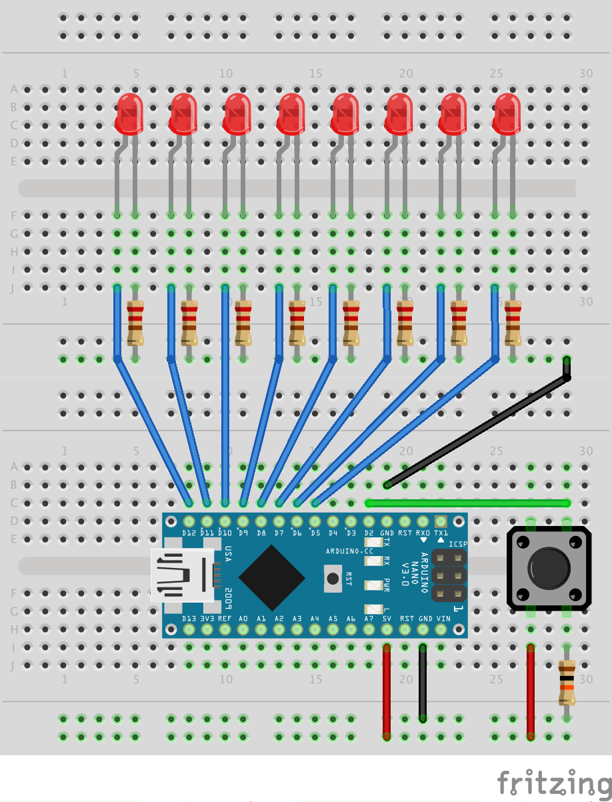
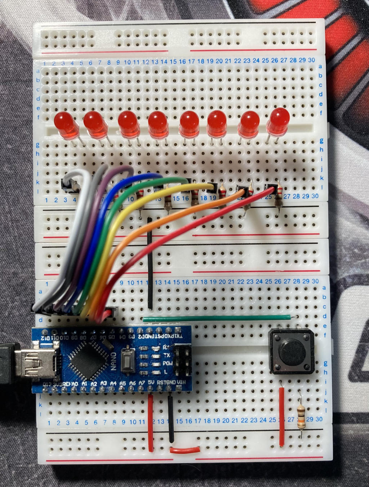
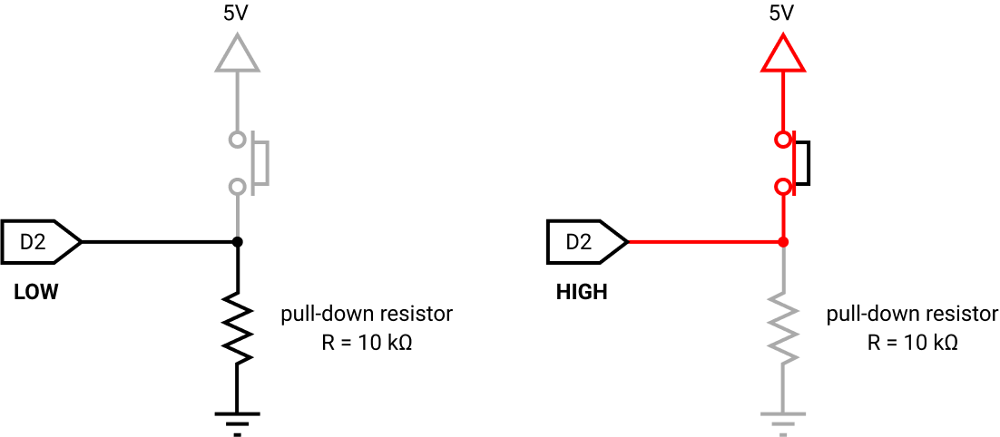
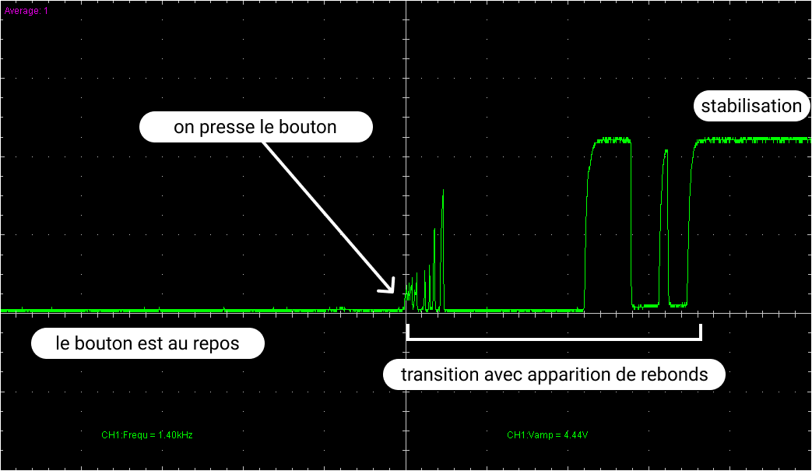

# Contrôle d'un chenillard à 8 LEDs par un bouton poussoir

L'objectif de cet atelier est de poursuivre le travail que nous avons commencé sur le [chenillard à 8 LEDs][led-chaser]. Nous allons ajouter un bouton poussoir dans notre petit circuit électronique pour commander la rampe de LEDs. J'utilise ici une carte [Arduino Nano][nano], mais vous pouvez tout à fait réaliser le même montage avec une carte [Arduino Uno][uno]. Le raccordement des LEDs et du bouton poussoir sur les broches de commandes numériques de la carte Arduino est exactement le même.

<table>
    <tbody>
        <tr>
            <td></td>
            <td></td>
        </tr>
    </tbody>
</table>


## Schéma de câblage du prototype

Les anodes (+) de chaque LED sont respectivement reliées, dans le même ordre, aux broches **D5** à **D12** (de droite à gauche) de la carte Arduino. Les cathodes (-), quant à elles, sont toutes reliées à la masse, c'est-à-dire à la broche **GND** de la carte Arduino, au travers d'une résistance de **220 Ω** pour limiter l'intensité du courant qui traversera les LEDs, et les protéger d'une dégradation qui leur serait fatale.

On utilisera ici deux platines de prototypage pour que le câblage ne soit pas trop étriqué :

<table>
    <tbody>
        <tr>
            <td></td>
            <td></td>
        </tr>
    </tbody>
</table>

Le bouton poussoir, quant à lui, est relié à la broche **D2** de la carte Arduino pour qu'on puisse lire son état (enfoncé / relâché), ainsi qu'à la broche d'alimentation **5V** de la carte Arduino, qui permettra de faire circuler un courant électrique lorsque le bouton sera enfoncé et, dans le même temps, de basculer la broche de lecture **D2** à l'état `HIGH`. Lorsque le bouton est relâché, pour éviter que la broche de lecture **D2** ne se trouve dans un état flottant et oscille intempestivement entre les états logiques `HIGH` et `LOW`, il convient de la relier à la masse (**GND**) au travers d'une résistance de rappel de **10 kΩ**. Cette résistance est ainsi caractérisée comme une résistance **pull-down** et permet de maintenir l'état de la broche de lecture **D2** au niveau logique `LOW` lorsque le bouton est relâché. La valeur élevée de la résistance permet de limiter l'intensité du courant à une valeur très faible lorsque le bouton est enfoncé et que le circuit est fermé entre la broche d'alimentation **5V** et la masse.

<p align="center">
    
</p>


## Effet rebond du bouton poussoir

Le bouton est un dispositif mécanique dans lequel les éléments de contacts s'entrechoquent lorsqu'on enfonce ou relâche le poussoir. À l'échelle temporelle de traitement de l'information, induite par l'activité électronique au niveau de la carte Arduino, on observe donc une phase de transition pendant laquelle apparaissent des effets rebonds indésirables. Le bouton ne change pas instantanément d'état lorsqu'on agit dessus, et la broche de lecture de la carte Arduino va donc détecter une succession de changements d'états logiques `HIGH` / `LOW` avant de se stabiliser. Voilà par exemple ce qui se passe lorsqu'on presse le bouton :

<p align="center">
    
</p>

Un phénomène similaire apparaît également lorsqu'on relâche le bouton et que la broche de lecture repasse à l'état `LOW`. Le profil des changements d'états qui surviennent pendant la phase transitionnelle où l'on observe les effets rebonds dépend de plusieurs facteurs comme la structure du bouton lui-même, ou la manière dont l'utilisateur enfonce ou relâche le poussoir. La durée de cette phase peut également être variable d'un bouton à l'autre.

Nous allons voir, avec les exercices proposés, comment mettre en évidence ce phénomène, et surtout comment en tenir compte pour éliminer ses effets indésirables et gérer proprement la réponse du micro-contrôleur aux signaux perturbés induits par l'action de l'utilisateur sur le bouton.


## Configuration du projet PlatformIO

La configuration du projet est définie par les directives inscrites dans le fichier `platformio.ini` :

```ini
[env:led-chaser]
platform  = atmelavr
board     = nanoatmega328
framework = arduino
```

Le projet est ici configuré pour être téléversé sur une carte Arduino **Nano**. Si, de votre côté, vous utilisez une carte Arduino **Uno**, vous devez remplacer la désignation de la carte `board` par la valeur `uno` :

```ini
[env:led-chaser]
platform  = atmelavr
board     = uno
framework = arduino
```


## Organisation des codes sources

Chaque exercice proposé correspond à un programme Arduino indépendant des autres exercices. Néanmoins, pour ne pas avoir à gérer autant de projets PlatformIO qu'il y'a d'exercices, on peut s'arranger pour tous les faire coexister au sein d'un même projet. Il existe différentes façons de mettre cela en oeuvre avec PlatformIO, et nous avons déjà appliqué l'une d'entre elles dans [l'atelier précédent][led-chaser]. Cette fois, nous allons procéder autrement.

Chaque exercice est traité dans un fichier source portant l'extension `.cpp` et stocké dans le dossier `src`. Par défaut, PlatformIO se charge de compiler tous les fichiers sources qu'il trouve dans le dossier `src`, et notamment le traditionnel `main.cpp`. Aussi, pour modifier ce comportement, il existe une directive très pratique à insérer dans le fichier `platformio.ini` qui va nous permettre d'indiquer précisément ce qu'il faut compiler ou non. Par exemple, si l'on souhaite compiler le programme décrit dans le fichier `01-basic-button.cpp`, il suffira de le spécifier à l'aide de la directive `src_filter` de la manière suivante :

```ini
[env:led-chaser]
platform   = atmelavr
board      = uno
framework  = arduino
src_filter = -<*> +<01-basic-button.cpp>
```

Par conséquent, pour compiler un autre programme, vous devrez préciser le nom du fichier correspondant.

Chaque fichier solution est spécifique et indépendant des autres. Vous ne pouvez en compiler qu'un seul à la fois.

*Reportez-vous à la documentation officielle de PlatformIO pour plus de détails sur [la directive `src_filter`][src-filter].*


**Bon code !**


[led-chaser]: https://github.com/Robotic974/led-chaser
[nano]:       https://store.arduino.cc/arduino-nano
[uno]:        https://store.arduino.cc/arduino-uno-rev3
[src-filter]: https://docs.platformio.org/en/latest/projectconf/section_env_build.html#src-filter